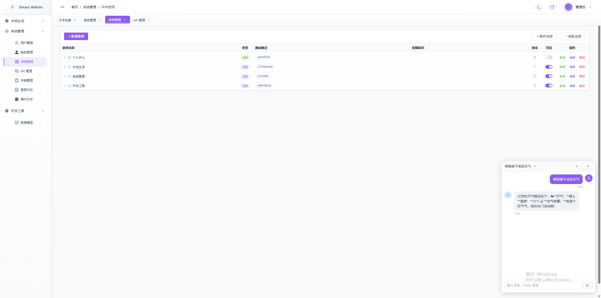

# Smart Admin

<p align="center">
  
  
  
  
  
  
</p>

<p align="center">
  <b>基于 Vue 3 + Spring Boot 3.x + LangChain 的现代化管理后台</b>
</p>

<p align="center">
  开箱即用 · AI 赋能 · 安全易用 · 界面美观 · 快速上手
</p>

> 🤖 **AI 助手**：内置流式对话、Tool Calling、RAG 扩展能力，让 AI 成为你的智能副手

---

## 功能特性

| 模块 | 说明 |
|:-----|:-----|
| 用户管理 | 用户增删改查、角色分配 |
| 角色权限 | RBAC 权限模型，菜单/按钮级别控制 |
| 菜单管理 | 目录/菜单/按钮三级管理 |
| 字典管理 | 动态字典配置 |
| 操作日志 | AOP 自动记录用户操作 |
| 饮食记录 | 饮食日志，卡片/日历多视图 |
| 脑暴笔记 | 灵感收集，快捷键快速添加 |
| 任务记录 | 甘特图展示，拖拽进度管理 |
| 文本收藏 | Markdown 收藏，编辑/预览分离 |
| AI 助手 | 流式对话，Tool Calling，可拖拽悬浮窗 |

**系统特性：** 动态路由 · 浅色/深色主题 · 响应式布局 · JWT 认证 · 操作日志审计

---

## 🤖 AI 能力

内置 AI 助手模块，基于 **Python 微服务** + **LangChain** 构建：

| 能力 | 说明 |
|:-----|:-----|
| 流式对话 | SSE 实时推送，打字机效果，支持中断 |
| Tool Calling | AI 可调用系统工具（查天气、查用户、计算器等） |
| 会话管理 | 独立会话历史，自动生成标题 |
| 可拖拽窗口 | 右下角悬浮窗，拖拽定位，随时呼出 |
| RAG 扩展 | 预留架构，支持知识库增强（规划中） |

**架构：**
```
前端(Vue3) → Java后端(Session管理) → Python AI服务(LangChain+DeepSeek)
```

---

## 技术栈

| 后端 | 前端 | AI 服务 |
|:-----|:-----|:-----|
| Spring Boot | Vue 3 | FastAPI |
| MyBatis Plus | Vite | LangChain |
| MySQL | Element Plus | DeepSeek（OpenAI 兼容） |
| JWT | Pinia | Tool Calling |
| Knife4j | TypeScript | SSE 流式响应 |

---

## 快速开始

**环境：** JDK 17+ · Node.js 18+ · Python 3.10+ · MySQL 8+

```bash
# 1. 初始化数据库
mysql -u root -p -e "CREATE DATABASE IF NOT EXISTS smart_admin DEFAULT CHARACTER SET utf8mb4;"
mysql -u root -p smart_admin < sql/smart_admin.sql

# 2. 启动后端
cd smart-admin-server && mvn spring-boot:run

# 3. 启动前端
cd smart-admin-web && pnpm install && pnpm dev

# 4. 启动 AI 服务（可选）
cd smart-admin-ai && pip install -r requirements.txt && python main.py
```

> 默认账号：`admin` / `admin123`

**访问地址：**
- 前端：http://localhost:3000
- 后端：http://localhost:8080
- AI 服务：http://localhost:8000/docs

---

## 项目结构

```
smart-admin/
├── smart-admin-server/    # Spring Boot 后端
├── smart-admin-web/       # Vue 3 前端
├── smart-admin-ai/        # Python AI 服务（FastAPI + LangChain）
└── sql/                   # 数据库脚本
```

---

## 预览截图



---

## License

[MIT License](LICENSE)
